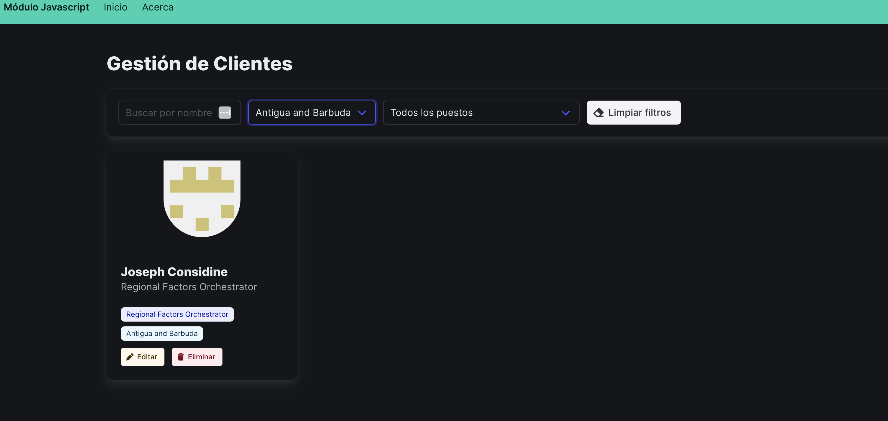

#  Buscador de Clientes – Módulo JavaScript

Aplicación web desarrollada como **Trabajo Práctico Integrador** del módulo JavaScript.  
Permite consultar, filtrar y visualizar información de clientes obtenida desde [MockAPI](https://mockapi.io).

---
## 🚀 Estado del proyecto

✅ Conexión con MockAPI y fetch de datos funcionando  
✅ Renderizado de tarjetas con avatar, nombre, puesto y país  
✅ Barra de navegación añadida  
✅ Filtros dinámicos (país y puesto) generados desde los datos  
✅ Búsqueda por nombre y botón de limpiar filtros  
✅ CRUD completo: agregar, editar y eliminar clientes con modales  
✅ Confirmación de eliminación con modal Bulma  
✅ Loader/spinner durante operaciones de carga  
✅ Notificaciones de estado (éxito/error) con Bulma  
✅ Responsive con Bulma (sin CSS adicional)  
✅ README con instrucciones y capturas añadidas  
✅ Proyecto listo para entrega final

---
## 🖼️ Capturas de pantalla
  

---

## 🧩 Funcionalidades implementadas

- Obtener datos desde MockAPI usando `fetch`.
- Guardar los datos en memoria (`allClients`) para evitar múltiples llamadas.
- Renderizar clientes en formato de tarjetas con **Bulma** y **Font Awesome**.
- Generar opciones de filtro dinámicas (País y Puesto) según la base de datos.
- Barra de navegación con botón para agregar clientes (CRUD pendiente).

## 📦 Tecnologías utilizadas

- **HTML5** 
- [Bulma](https://bulma.io/) – Framework CSS  
- [Font Awesome](https://fontawesome.com/) – Íconos  
- JavaScript (ES6+)

## 🛠️ Instalación y configuración

### Requisitos
- Navegador moderno (Chrome, Firefox, Edge o Safari).
- **No** requiere Node ni build. Es una SPA estática con Bulma.

---

## 👩‍💻 Autora

- **Priscila Rosales**  
  [GitHub](https://github.com/PriscilaRosales)
