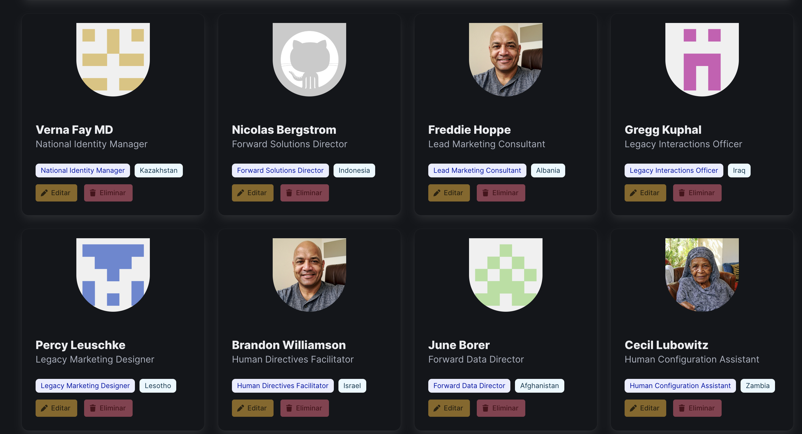
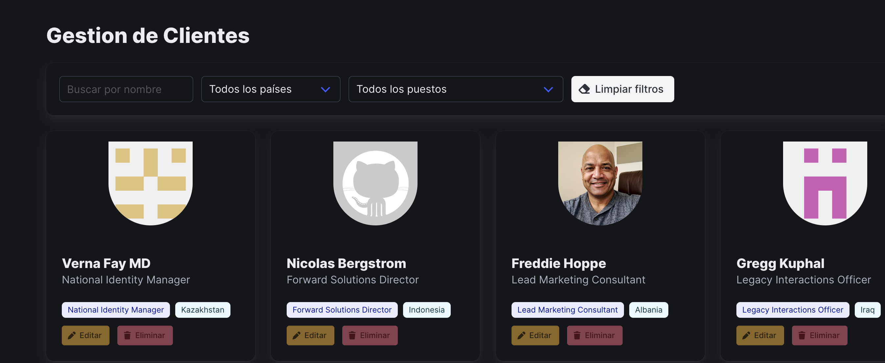

#  Buscador de Clientes – Módulo JavaScript

Aplicación web desarrollada como **Trabajo Práctico Integrador** del módulo JavaScript.  
Permite consultar, filtrar y visualizar información de clientes obtenida desde [MockAPI](https://mockapi.io).

---
## 🚀 Estado del proyecto

✅ Conexión con MockAPI y primer `fetch` implementado  
✅ Renderizado de tarjetas básicas con datos reales  
✅ Barra de navegación añadida  
✅ Filtros dinámicos (país y puesto) generados desde los datos  
🔄 Próximo paso: conectar los filtros con eventos y limpiar resultados

---
## 🖼️ Capturas de pantalla
  

---

## 🧩 Funcionalidades implementadas

- Obtener datos desde MockAPI usando `fetch`.
- Guardar los datos en memoria (`allClients`) para evitar múltiples llamadas.
- Renderizar clientes en formato de tarjetas con **Bulma** y **Font Awesome**.
- Generar opciones de filtro dinámicas (País y Puesto) según la base de datos.
- Barra de navegación con botón para agregar clientes (CRUD pendiente).

## 📦 Tecnologías utilizadas

- **HTML5** 
- [Bulma](https://bulma.io/) – Framework CSS  
- [Font Awesome](https://fontawesome.com/) – Íconos  
- JavaScript (ES6+)

---

## 👩‍💻 Autora

- **Priscila Rosales**  
  [GitHub](https://github.com/PriscilaRosales)
